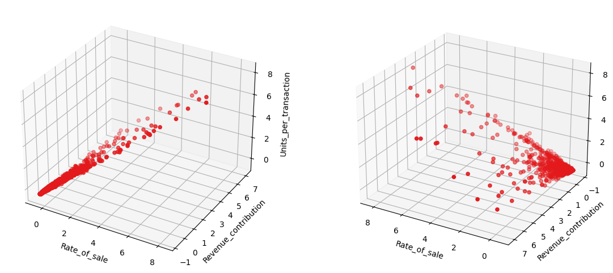
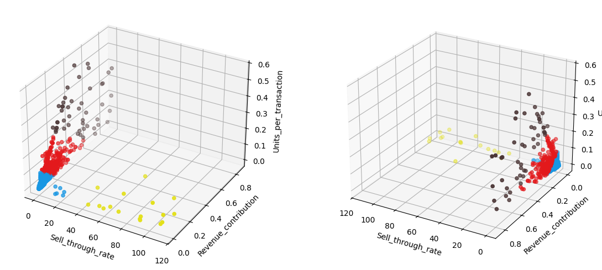

# SKU Portfolio Evaluation Dashboard

## Overview

### Problem Statement
Stock Keeping Units(SKUs) are unique product identifiers used for sales and inventory tracking. Retiring underperforming SKUs helps reallocate resources, free capacity for innovation and align portfolios with consumer trends and brand strategies.
The usual process is slow and rigid: data is filtered by fixed KPI thresholds, reviewed separately by stakeholders and finalized in authority-driven meetings. This approach risks missing true underperformers, duplicates effort and can bias decisions.

### Solution Overview
A dashboard can centralize SKU evaluation, visualizing performance KPIs and using clustering techniques to group SKUs by performance level. This reduces reliance on rigid thresholds and provides a shared, unbiased view for all stakeholders, thus streamlining analysis and decision-making.

### Business Impact
A dashboard can accelerate evaluations, improve portfolio profitability and reduce operational complexity. Organizations using similar approaches have cut evaluation time by up to 75-80% and achieved revenue growth of ~8.6% year-over-year([Georgia Tech Capstone](https://capstone.isye.gatech.edu/research/coca-cola-portfolio-evaluation-process), [MetricsCart](https://metricscart.com/insights/sku-rationalization-in-e-commerce/)).

## Technical Documentation

### Dataset
The dataset used in this project comes from [Kaggle](https://www.kaggle.com/datasets/thedevastator/online-retail-sales-and-customer-data).
It includes eight columns:
| Column | Description |
| :--- | :--- |
| InvoiceNo | Transaction ID(IDs starting with "C" indicate purchases). |
| StockCode | Product identifier(renamed to SKU later). |
| Description | Short description of the product. |
| Quantity | Number of units per transaction. |
| InvoiceDate | Date of transaction. |
| UnitPrice | Price per product unit. |
| CustomerID | Unique customer or supplier ID. |
| Country | Country of origin or destination. |

### Methodology
#### Data Cleaning
The raw dataset contained missing values in the "Description" and "CustomerID" columns. When possible, missing descriptions were filled using values from other rows with the same SKU, otherwise, they were replaced with "No description". The same approach was applied to "CustomerID", substituting missing entries with "No account". 
The "StockCode" column was renamed to SKU to align with the project terminology and transactions with negative quantities that were not labeled as purchases, unit prices equal to zero or non-numeric SKU codes were removed, as they represented adjustments or invalid records. Similarly, rows with lowercase descriptions were excluded for consistency. 
Outliers were identified and removed using the interquartile range method, meaning that values beyond Q1 - 1.5 * (Q3-Q1) and Q3 + 1.5 * (Q3-Q1) were excluded. Additionally, SKUs with only one unit sold or with a sell-through rate above 100% were dropped, as such entries reflected data inconsistencies.

#### KPI Calculation
All KPIs used were calculated at the SKU level: 
Revenue Contribution = SKU revenue / total revenue  
Sales Contribution = SKU units sold / total units sold  
Sell-Through Rate = SKU units sold / SKU units purchased  
Rate of Sale = SKU units sold / number of weeks in the period of calculation  
Gross Margin = (SKU revenue - SKU costs) / SKU revenue  
Units per Transaction = SKU units sold / total number of transactions  

These KPIs fall into three categories:
- Efficiency: Sell-Through Rate, Rate of Sale.
- Profitability: Revenue Contribution, Gross Margin.
- Sales behavior: Sales Contribution, Units per Transaction.

One KPI from each category(Rate of Sale, Revenue Contribution and Units per Transaction) were standardized and used for clustering.

#### Clustering
Before clustering

After clustering

K-Means clustering was applied to group SKUs by performance.
| Cluster | Color | Label |
| :--- | :--- | :--- |
| 0 | Red | Low |
| 1 | Blue | High |
| 2 | Yellow | Moderate |

Low-performing SKUs consistently show lower median values than the global medians for rate of sale, revenue contribution and units per transaction, confirming their potential for retirement.