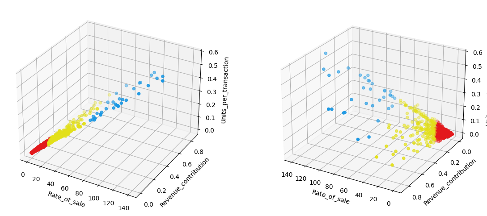

```python
import pandas as pd

df = pd.read_csv('../data/processed/sku_kpi.csv')
```


```python
df.describe()
```


<div>
<style scoped>
    .dataframe tbody tr th:only-of-type {
        vertical-align: middle;
    }

    .dataframe tbody tr th {
        vertical-align: top;
    }

    .dataframe thead th {
        text-align: right;
    }
</style>
<table border="1" class="dataframe">
  <thead>
    <tr style="text-align: right;">
      <th></th>
      <th>SKU</th>
      <th>Revenue_contribution</th>
      <th>Sales_contribution</th>
      <th>Sell_through_rate</th>
      <th>Rate_of_sale</th>
      <th>Gross_margin</th>
      <th>Units_per_transaction</th>
    </tr>
  </thead>
  <tbody>
    <tr>
      <th>count</th>
      <td>1325.000000</td>
      <td>1325.000000</td>
      <td>1325.000000</td>
      <td>1325.000000</td>
      <td>1325.000000</td>
      <td>1325.000000</td>
      <td>1325.000000</td>
    </tr>
    <tr>
      <th>mean</th>
      <td>34034.453585</td>
      <td>0.075374</td>
      <td>0.075200</td>
      <td>1.123495</td>
      <td>8.884755</td>
      <td>98.528400</td>
      <td>0.035947</td>
    </tr>
    <tr>
      <th>std</th>
      <td>24132.626207</td>
      <td>0.109243</td>
      <td>0.134389</td>
      <td>9.603051</td>
      <td>15.799021</td>
      <td>12.293318</td>
      <td>0.064693</td>
    </tr>
    <tr>
      <th>min</th>
      <td>10002.000000</td>
      <td>0.000000</td>
      <td>0.000000</td>
      <td>0.000000</td>
      <td>0.000000</td>
      <td>-100.000000</td>
      <td>0.000000</td>
    </tr>
    <tr>
      <th>25%</th>
      <td>21500.000000</td>
      <td>0.010000</td>
      <td>0.010000</td>
      <td>0.000000</td>
      <td>0.840000</td>
      <td>100.000000</td>
      <td>0.000000</td>
    </tr>
    <tr>
      <th>50%</th>
      <td>22562.000000</td>
      <td>0.040000</td>
      <td>0.030000</td>
      <td>0.000000</td>
      <td>3.040000</td>
      <td>100.000000</td>
      <td>0.010000</td>
    </tr>
    <tr>
      <th>75%</th>
      <td>23615.000000</td>
      <td>0.090000</td>
      <td>0.080000</td>
      <td>0.000000</td>
      <td>9.850000</td>
      <td>100.000000</td>
      <td>0.040000</td>
    </tr>
    <tr>
      <th>max</th>
      <td>90194.000000</td>
      <td>0.850000</td>
      <td>1.190000</td>
      <td>112.500000</td>
      <td>140.300000</td>
      <td>100.000000</td>
      <td>0.570000</td>
    </tr>
  </tbody>
</table>
</div>


```python
from sklearn.preprocessing import StandardScaler
import matplotlib.pyplot as plt
from src import config
```


```python
features = df[["Sell_through_rate", "Revenue_contribution", "Units_per_transaction"]]
scaler = StandardScaler()
features_std = scaler.fit_transform(features)
```


```python
fig = plt.figure(figsize=(14, 6))
ax1 = fig.add_subplot(121, projection='3d')
ax1.scatter(features_std[:,0], features_std[:,1], features_std[:,2], c = config.light_color_palette[0], marker = 'o')

ax1.set_xlabel(features.columns[0])
ax1.set_ylabel(features.columns[1])
ax1.set_zlabel(features.columns[2])

ax1.view_init(elev = 30, azim=-60)

ax2 = fig.add_subplot(122, projection='3d')
ax2.scatter(features_std[:,0], features_std[:,1], features_std[:,2], c = config.light_color_palette[0], marker = 'o')

ax2.set_xlabel(features.columns[0])
ax2.set_ylabel(features.columns[1])
ax2.set_zlabel(features.columns[2])

ax2.view_init(elev = 25, azim=120)
plt.show()
```


    

    


```python
from sklearn.cluster import KMeans

inertias = []
silhouette = []
k_values = list(range(2, 10))
for k in k_values:
    km = KMeans(n_clusters=k, random_state= 10, n_init=50)
    labels = km.fit_predict(features_std)
    inertias.append(km.inertia_)
```


```python
plt.figure()
plt.plot(k_values, inertias, marker="x", c = config.light_color_palette[1])
plt.grid(True)
plt.show()
```


    

    


```python
kmeans = KMeans(n_clusters=4, random_state=10, n_init=100)
labels_f = kmeans.fit_predict(features_std)
features["Cluster"] = labels_f
```

    C:\Users\spanu\AppData\Local\Temp\ipykernel_2588\1083615637.py:3: SettingWithCopyWarning: 
    A value is trying to be set on a copy of a slice from a DataFrame.
    Try using .loc[row_indexer,col_indexer] = value instead
    
    See the caveats in the documentation: https://pandas.pydata.org/pandas-docs/stable/user_guide/indexing.html#returning-a-view-versus-a-copy
      features["Cluster"] = labels_f
    


```python
from matplotlib.colors import ListedColormap

colors = config.light_color_palette[:3]
colors.append(config.dark_color_palette[0])
cmap = ListedColormap(colors)

fig = plt.figure(figsize=(14, 6))
ax1 = fig.add_subplot(121, projection='3d')
ax1.scatter(
    features["Sell_through_rate"], 
    features["Revenue_contribution"], 
    features["Units_per_transaction"], 
    c = features["Cluster"], 
    cmap = cmap,
    marker = 'o')

ax1.set_xlabel(features.columns[0])
ax1.set_ylabel(features.columns[1])
ax1.set_zlabel(features.columns[2])

#ax1.view_init(elev = 10, azim=150)
ax1.view_init(elev = 30, azim=-60)

ax2 = fig.add_subplot(122, projection='3d')
ax2.scatter(
    features["Sell_through_rate"], 
    features["Revenue_contribution"], 
    features["Units_per_transaction"], 
    c = features["Cluster"],
    cmap = cmap,
    marker = 'o')

ax2.set_xlabel(features.columns[0])
ax2.set_ylabel(features.columns[1])
ax2.set_zlabel("UPT")

ax2.view_init(elev = 25, azim=120)
plt.show()
```


    

    

