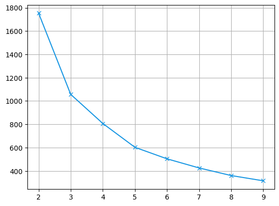

```python
import pandas as pd

df = pd.read_csv('../data/interim/sku_kpi.csv')
```


```python
df.describe()
```


<div>
<style scoped>
    .dataframe tbody tr th:only-of-type {
        vertical-align: middle;
    }

    .dataframe tbody tr th {
        vertical-align: top;
    }

    .dataframe thead th {
        text-align: right;
    }
</style>
<table border="1" class="dataframe">
  <thead>
    <tr style="text-align: right;">
      <th></th>
      <th>SKU</th>
      <th>Revenue_contribution</th>
      <th>Sales_contribution</th>
      <th>Sell_through_rate</th>
      <th>Rate_of_sale</th>
      <th>Gross_margin</th>
      <th>Units_per_transaction</th>
    </tr>
  </thead>
  <tbody>
    <tr>
      <th>count</th>
      <td>1317.000000</td>
      <td>1317.000000</td>
      <td>1317.000000</td>
      <td>1317.000000</td>
      <td>1317.000000</td>
      <td>1317.000000</td>
      <td>1317.000000</td>
    </tr>
    <tr>
      <th>mean</th>
      <td>34109.052392</td>
      <td>0.075862</td>
      <td>0.075718</td>
      <td>0.650820</td>
      <td>8.872718</td>
      <td>98.524814</td>
      <td>0.035923</td>
    </tr>
    <tr>
      <th>std</th>
      <td>24186.484389</td>
      <td>0.109749</td>
      <td>0.135602</td>
      <td>6.548788</td>
      <td>15.817831</td>
      <td>12.330377</td>
      <td>0.064790</td>
    </tr>
    <tr>
      <th>min</th>
      <td>10002.000000</td>
      <td>0.000000</td>
      <td>0.000000</td>
      <td>0.000000</td>
      <td>0.000000</td>
      <td>-100.000000</td>
      <td>0.000000</td>
    </tr>
    <tr>
      <th>25%</th>
      <td>21500.000000</td>
      <td>0.010000</td>
      <td>0.010000</td>
      <td>0.000000</td>
      <td>0.840000</td>
      <td>100.000000</td>
      <td>0.000000</td>
    </tr>
    <tr>
      <th>50%</th>
      <td>22562.000000</td>
      <td>0.040000</td>
      <td>0.030000</td>
      <td>0.000000</td>
      <td>3.040000</td>
      <td>100.000000</td>
      <td>0.010000</td>
    </tr>
    <tr>
      <th>75%</th>
      <td>23616.000000</td>
      <td>0.090000</td>
      <td>0.080000</td>
      <td>0.000000</td>
      <td>9.760000</td>
      <td>100.000000</td>
      <td>0.040000</td>
    </tr>
    <tr>
      <th>max</th>
      <td>90194.000000</td>
      <td>0.850000</td>
      <td>1.200000</td>
      <td>97.363636</td>
      <td>140.300000</td>
      <td>100.000000</td>
      <td>0.570000</td>
    </tr>
  </tbody>
</table>
</div>


```python
from sklearn.preprocessing import StandardScaler
import matplotlib.pyplot as plt
from src import config
```


```python
features = ["Rate_of_sale", "Revenue_contribution", "Units_per_transaction"]
scaler = StandardScaler()
features_std = scaler.fit_transform(df[features])
```


```python
fig = plt.figure(figsize=(14, 6))
ax1 = fig.add_subplot(121, projection='3d')
ax1.scatter(
    features_std[:,0], 
    features_std[:,1], 
    features_std[:,2], 
    c = config.light_color_palette[0], 
    marker = 'o')

ax1.set_xlabel(features[0])
ax1.set_ylabel(features[1])
ax1.set_zlabel(features[2])

ax1.view_init(elev = 30, azim=-60)

ax2 = fig.add_subplot(122, projection='3d')
ax2.scatter(
    features_std[:,0], 
    features_std[:,1], 
    features_std[:,2], 
    c = config.light_color_palette[0], 
    marker = 'o')

ax2.set_xlabel(features[0])
ax2.set_ylabel(features[1])
ax2.set_zlabel(features[2])

ax2.view_init(elev = 25, azim=120)
plt.show()
```


    

    


```python
from sklearn.cluster import KMeans

inertias = []
silhouette = []
k_values = list(range(2, 10))
for k in k_values:
    km = KMeans(n_clusters=k, random_state= 10, n_init=50)
    labels = km.fit_predict(features_std)
    inertias.append(km.inertia_)
```


```python
plt.figure()
plt.plot(k_values, inertias, marker="x", c = config.light_color_palette[1])
plt.grid(True)
plt.show()
```


    

    


```python
kmeans = KMeans(n_clusters=3, random_state=10, n_init=100)
labels_f = kmeans.fit_predict(features_std)
df["Cluster"] = labels_f
```


```python
from matplotlib.colors import ListedColormap

cmap = ListedColormap(config.light_color_palette[:3])

fig = plt.figure(figsize=(14, 6))
ax1 = fig.add_subplot(121, projection='3d')
ax1.scatter(
    df["Rate_of_sale"], 
    df["Revenue_contribution"], 
    df["Units_per_transaction"], 
    c = df["Cluster"], 
    cmap = cmap,
    marker = 'o')

ax1.set_xlabel(features[0])
ax1.set_ylabel(features[1])
ax1.set_zlabel(features[2])

ax1.view_init(elev = 30, azim=-60)

ax2 = fig.add_subplot(122, projection='3d')
ax2.scatter(
    df["Rate_of_sale"], 
    df["Revenue_contribution"], 
    df["Units_per_transaction"], 
    c = df["Cluster"],
    cmap = cmap,
    marker = 'o')

ax2.set_xlabel(features[0])
ax2.set_ylabel(features[1])
ax2.set_zlabel(features[2])

ax2.view_init(elev = 25, azim=120)
plt.show()
```


    

    


```python
def cluster_profiling(df: pd.DataFrame, feature: str) -> pd.DataFrame:
    cluster = df.groupby("Cluster")[feature].agg(["count", "median", "mean"]).reset_index()
    glb = pd.DataFrame({
        "Cluster": "global",
        "count": [df[feature].count()],
        "median": [df[feature].median()],
        "mean": [df[feature].mean()]
    })
    final = pd.concat([cluster, glb])
    
    return final
```


```python
cluster_profiling(df, "Rate_of_sale")
```


<div>
<style scoped>
    .dataframe tbody tr th:only-of-type {
        vertical-align: middle;
    }

    .dataframe tbody tr th {
        vertical-align: top;
    }

    .dataframe thead th {
        text-align: right;
    }
</style>
<table border="1" class="dataframe">
  <thead>
    <tr style="text-align: right;">
      <th></th>
      <th>Cluster</th>
      <th>count</th>
      <th>median</th>
      <th>mean</th>
    </tr>
  </thead>
  <tbody>
    <tr>
      <th>0</th>
      <td>0</td>
      <td>1063</td>
      <td>2.08</td>
      <td>3.435155</td>
    </tr>
    <tr>
      <th>1</th>
      <td>1</td>
      <td>34</td>
      <td>81.59</td>
      <td>84.082941</td>
    </tr>
    <tr>
      <th>2</th>
      <td>2</td>
      <td>220</td>
      <td>21.16</td>
      <td>23.522636</td>
    </tr>
    <tr>
      <th>0</th>
      <td>global</td>
      <td>1317</td>
      <td>3.04</td>
      <td>8.872718</td>
    </tr>
  </tbody>
</table>
</div>


```python
cluster_profiling(df, "Revenue_contribution")
```


<div>
<style scoped>
    .dataframe tbody tr th:only-of-type {
        vertical-align: middle;
    }

    .dataframe tbody tr th {
        vertical-align: top;
    }

    .dataframe thead th {
        text-align: right;
    }
</style>
<table border="1" class="dataframe">
  <thead>
    <tr style="text-align: right;">
      <th></th>
      <th>Cluster</th>
      <th>count</th>
      <th>median</th>
      <th>mean</th>
    </tr>
  </thead>
  <tbody>
    <tr>
      <th>0</th>
      <td>0</td>
      <td>1063</td>
      <td>0.030</td>
      <td>0.039426</td>
    </tr>
    <tr>
      <th>1</th>
      <td>1</td>
      <td>34</td>
      <td>0.345</td>
      <td>0.421471</td>
    </tr>
    <tr>
      <th>2</th>
      <td>2</td>
      <td>220</td>
      <td>0.170</td>
      <td>0.198500</td>
    </tr>
    <tr>
      <th>0</th>
      <td>global</td>
      <td>1317</td>
      <td>0.040</td>
      <td>0.075862</td>
    </tr>
  </tbody>
</table>
</div>


```python
cluster_profiling(df, "Units_per_transaction")
```


<div>
<style scoped>
    .dataframe tbody tr th:only-of-type {
        vertical-align: middle;
    }

    .dataframe tbody tr th {
        vertical-align: top;
    }

    .dataframe thead th {
        text-align: right;
    }
</style>
<table border="1" class="dataframe">
  <thead>
    <tr style="text-align: right;">
      <th></th>
      <th>Cluster</th>
      <th>count</th>
      <th>median</th>
      <th>mean</th>
    </tr>
  </thead>
  <tbody>
    <tr>
      <th>0</th>
      <td>0</td>
      <td>1063</td>
      <td>0.01</td>
      <td>0.013650</td>
    </tr>
    <tr>
      <th>1</th>
      <td>1</td>
      <td>34</td>
      <td>0.33</td>
      <td>0.343235</td>
    </tr>
    <tr>
      <th>2</th>
      <td>2</td>
      <td>220</td>
      <td>0.09</td>
      <td>0.096045</td>
    </tr>
    <tr>
      <th>0</th>
      <td>global</td>
      <td>1317</td>
      <td>0.01</td>
      <td>0.035923</td>
    </tr>
  </tbody>
</table>
</div>


